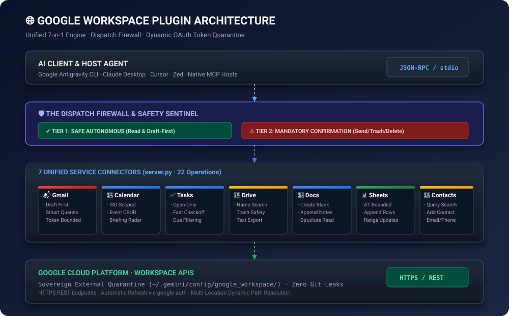

<div align="center">

# 🌐 Antigravity Google Workspace Plugin

### *Unified Automation Bridge, Token-Optimized Telemetry & Dispatch Firewall for Google Workspace (Gmail · Drive · Docs · Sheets · Calendar · Tasks · Contacts)*

<br/>

<a href="https://github.com/karansinghverma979/antigravity-google-workspace-plugin">
  
</a>

<br/>
<br/>

<!-- Shields Row 1: Ecosystem & Protocols -->
<p align="center">
  <a href="https://github.com/karansinghverma979/antigravity-google-workspace-plugin">
    
  </a>
  <a href="https://modelcontextprotocol.io">
    
  </a>
  <a href="https://cloud.google.com">
    
  </a>
  <a href="LICENSE">
    
  </a>
</p>

<!-- Shields Row 2: Security & Governance -->
<p align="center">
  
  
  
  
</p>

<p align="center">
  <b>Empower your AI assistants with unified, token-efficient, and secure access across the entire Google Workspace ecosystem. Built with native safety guardrails to prevent accidental dispatches or data loss.</b>
</p>

---

</div>

<br/>

## 📖 Why Google Workspace Plugin?

Most Google Workspace integrations force AI agents into one of two traps:
1. **Tool Overload & Context Bloat**: Splitting every Google service into a separate server wastes memory, burns LLM context with repetitive schemas, and dumps hundreds of emails into prompt memory.
2. **Unchecked Destructive Authority**: Giving an LLM unconstrained access to send live emails or delete Drive files leads to accidental outbounds and catastrophic data loss.

**Antigravity Google Workspace Plugin solves both**:
- 🌐 **7-in-1 Unified Hub**: A single, lightweight FastMCP engine connects Calendar, Tasks, Gmail, Drive, Docs, Sheets, and Contacts.
- 🛡️ **The Dispatch Firewall**: Read and draft operations execute instantly; high-risk actions (sending live emails, trashing Drive files, canceling meetings) require explicit user confirmation.
- ⚡ **Token-Optimized Telemetry**: Bounded list limits, smart search filtering (`newer_than:2d`, `is:unread`), and specific spreadsheet cell ranges prevent LLM context exhaustion.
- 🌅 **Morning Executive Briefing**: 1-shot situational routine combining calendar agenda, pending tasks, and unread priority emails into an actionable summary.

---

## 🏛️ System Architecture

<p align="center">
  
</p>

```text
┌─────────────────────────────────────────────────────────────────────────────┐
│                       GOOGLE ANTIGRAVITY AGENT / MCP HOST                   │
│                    (Antigravity CLI · Claude Desktop · Cursor)              │
└──────────────────────────────────────┬──────────────────────────────────────┘
                                       │ JSON-RPC (stdio)
                                       ▼
┌─────────────────────────────────────────────────────────────────────────────┐
│              ANTIGRAVITY GOOGLE WORKSPACE PLUGIN (mcp/server.py)            │
├─────────────────────────────────────────────────────────────────────────────┤
│ 🛡️ Strict Dispatch Firewall (Pre-Execution 3-Point Confirmation)           │
│ 🔐 OAuth 2.0 Dynamic Token Engine (Auto-Refresh & Local Quarantine)        │
├──────────────────────────────────────┬──────────────────────────────────────┤
│ 📅 Google Calendar (Agenda/Events)   │ 📬 Gmail (Draft-First & Search)      │
│ ✅ Google Tasks (Action Items)       │ 📂 Google Drive (Scoped Retrieval)   │
│ 📝 Google Docs (Document Engine)     │ 📊 Google Sheets (Bounded A1 Ranges) │
│ 👥 Google Contacts (Address Book)    │ ⚡ Error Filtration & Sanitizer      │
└──────────────────────────────────────┬──────────────────────────────────────┘
                                       │ HTTPS (Google APIs v1/v3/v4)
                                       ▼
┌─────────────────────────────────────────────────────────────────────────────┐
│                        GOOGLE CLOUD PLATFORM / WORKSPACE                    │
│        [ Gmail · Drive · Docs · Sheets · Calendar · Tasks · Contacts ]      │
└─────────────────────────────────────────────────────────────────────────────┘
```

---

## 🛡️ The Dispatch Firewall: Operational Safety Guardrails

To safeguard your communications and data, operations are partitioned into two strict security tiers:

| Tier | Operations | Execution Policy |
| :--- | :--- | :--- |
| **Tier 1: Safe Autonomous** | `gcal_list_events`, `gtasks_list_tasks`, `gmail_list_messages`, `gmail_get_message`, `gmail_create_draft`, `gdrive_search_files`, `gdrive_read_file`, `gdocs_read_doc`, `gsheets_read_range`, `gcontacts_list` | Executes autonomously with zero delay. |
| **Tier 2: High-Risk Dispatch** | `gmail_send_message`, `gdrive_trash_file`, `gcal_delete_event`, `gtasks_delete_task` | **Mandatory Confirmation**: Presents recipient/target, content preview, and requires user approval (`proceed`, `yes`) before execution. |

> [!TIP]
> **Draft-First Standard**: When asking the agent to email someone, it defaults to creating a draft via `gmail_create_draft`. You can review the draft in your Gmail inbox before authorizing live delivery.

---

## 🛠️ Tool Catalog (22 Operations Across 7 Services)

| Service | MCP Tool Name | Description |
| :--- | :--- | :--- |
| **📅 Calendar** | `gcal_list_events` | Fetch upcoming meetings with `time_min`, `time_max`, and `max_results`. |
| | `gcal_create_event` | Schedule new calendar events with title, timestamps, attendees, and location. |
| | `gcal_delete_event` | Cancel/delete an event by `event_id` *(Firewall Protected)*. |
| **✅ Tasks** | `gtasks_list_tasks` | List pending tasks from Google Tasks (`show_completed=false`). |
| | `gtasks_create_task` | Create new action items with title, notes, and due date. |
| | `gtasks_complete_task` | Mark a task completed by `task_id`. |
| | `gtasks_delete_task` | Delete a task from Google Tasks *(Firewall Protected)*. |
| **📬 Gmail** | `gmail_list_messages` | Query emails with standard Gmail search syntax (`is:unread`, `newer_than:2d`). |
| | `gmail_get_message` | Retrieve full message headers, subject, date, and body text. |
| | `gmail_create_draft` | Stage an unsent draft in Gmail (recommended workflow). |
| | `gmail_send_message` | Transmit live email to external recipients *(Firewall Protected)*. |
| | `gmail_trash_message` | Move unwanted email directly to Gmail trash. |
| **📂 Drive** | `gdrive_search_files` | Find files by name, MIME type, or full-text query. |
| | `gdrive_read_file` | Read plain text or markdown export of Google Drive files. |
| | `gdrive_trash_file` | Move files to Google Drive trash *(Firewall Protected)*. |
| **📝 Docs** | `gdocs_create_doc` | Create an empty Google Document. Returns new document ID. |
| | `gdocs_read_doc` | Read full document body, paragraphs, and structure. |
| | `gdocs_append_text` | Append text paragraphs or markdown sections to a doc. |
| **📊 Sheets** | `gsheets_read_range` | Read values from a spreadsheet using bounded A1 notation (`Sheet1!A1:E20`). |
| | `gsheets_append_row` | Append row arrays to the end of a spreadsheet. |
| | `gsheets_update_range` | Overwrite a specified A1 cell range with a 2D matrix of values. |
| **👥 Contacts** | `gcontacts_list` | Query address book contacts by name or email. |
| | `gcontacts_create` | Create a new contact with name, email, and phone. |

---

## 🚀 Quickstart & Setup

### 1. Prerequisites & Google Cloud Setup

1. Create a Google Cloud Project in the [Google Cloud Console](https://console.cloud.google.com).
2. Enable the following 7 APIs:
   - Google Calendar API
   - Google Tasks API
   - Gmail API
   - Google Drive API
   - Google Docs API
   - Google Sheets API
   - People API (Contacts)
3. Configure the **OAuth Consent Screen** (User Type: External, add your Google account as a Test User).
4. Create **OAuth 2.0 Client IDs** (Application Type: **Desktop app**).
5. Download the credentials JSON, rename it to `credentials.json`, and place it in `mcp/` or the plugin root.

### 2. Authentication Setup

Run the interactive local authenticator:
```bash
pip install -r mcp/requirements.txt
python mcp/auth_setup.py
```
A browser window will open automatically asking you to authorize your Google account. Upon approval, `token.json` is generated locally and cached for automated token refresh.

> [!TIP]
> **If the browser doesn't open automatically**: Copy the `AUTH_URL` printed in your terminal and paste it directly into your browser (Chrome/Edge/Brave).

---

### 🔑 Permanent Tokens: How to Bypass the 7-Day Expiration

By default, Google puts all new Google Cloud projects in **"Testing"** mode. Under Google's security policy, **refresh tokens in "Testing" mode strictly expire after 7 days (168 hours)**, forcing you to re-authenticate every week.

#### How to Make Your Refresh Token Permanent (Never Expires):
1. Open the [Google Cloud Console - OAuth Consent Screen](https://console.cloud.google.com/apis/credentials/consent).
2. Under **Publishing status**, click the button: **"PUBLISH APP"** and confirm.
3. Your app's status will change from **Testing** to **In Production**.
4. **Do you need Google verification? NO!**
   - For your own personal Google account, you do not need public verification.
   - When authenticating, Google will show a screen saying *"Google hasn't verified this app"*.
   - Click **Advanced ➔ Go to <Project Name> (unsafe)** and click **Continue**.
5. Once authorized, Google issues a **permanent refresh token that does not expire after 7 days**. You will never have to re-authenticate weekly again!

---

## ⚙️ Client Configurations

### Pathway A: Google Antigravity Plugin (Recommended)

1. Clone or copy into your local Antigravity plugins directory:
   ```bash
   git clone https://github.com/karansinghverma979/antigravity-google-workspace-plugin.git ~/.gemini/config/plugins/google-workspace-plugin
   ```
2. Add to your Antigravity `mcp_config.json`:
   ```json
   {
     "mcpServers": {
       "google-workspace-mcp": {
         "command": "python",
         "args": [
           "C:\\Users\\<YourUsername>\\.gemini\\config\\plugins\\google-workspace-plugin\\mcp\\server.py"
         ],
         "disabled": false
       }
     }
   }
   ```
3. Antigravity automatically loads `plugin.json`, activates the `google-workspace` skill (`skills/google-workspace/SKILL.md`), and registers the agent (`agents/google_workspace.md`).

### Pathway B: Claude Desktop (`claude_desktop_config.json`)

```json
{
  "mcpServers": {
    "google-workspace": {
      "command": "python",
      "args": [
        "/path/to/antigravity-google-workspace-plugin/mcp/server.py"
      ]
    }
  }
}
```

---

## 🔒 Security & Privacy Standard

- **Zero Token Commits**: `credentials.json` and `token.json` are strictly quarantined by `.gitignore`. A sanitized `credentials.json.example` is committed for reference.
- **Dynamic Path Expansion**: Supports `GOOGLE_WORKSPACE_TOKEN_PATH` and `GOOGLE_WORKSPACE_CREDENTIALS_PATH` environment variables, avoiding machine-specific paths.
- **OpenSSF CI Hardening**: GitHub Actions workflows enforce `permissions: contents: read` and pin dependencies to immutable 40-character commit SHAs.
- **Vulnerability Disclosure**: Managed through coordinated disclosure in [SECURITY.md](SECURITY.md).

---

<div align="center">

<b>Maintained by <a href="https://github.com/karansinghverma979">Karan Singh Verma</a> · Released under the MIT License</b>

</div>
