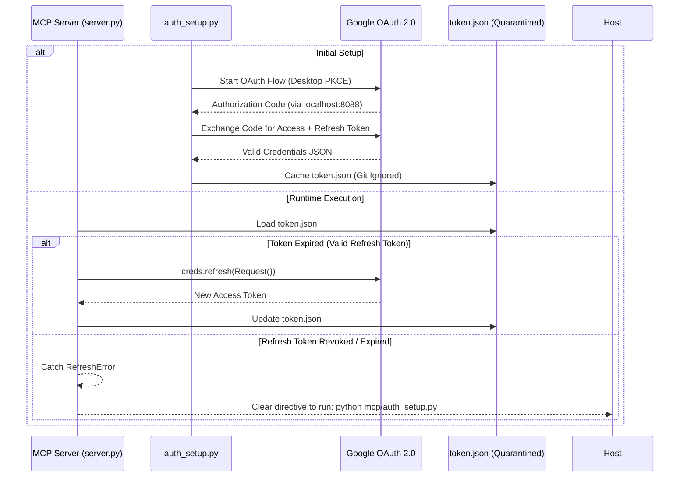

# 🌐 Antigravity Google Workspace Plugin: Developer Architecture Deep-Dive

This document details the internal architecture, OAuth 2.0 lifecycle, Dispatch Firewall design, and token management protocols of the **Antigravity Google Workspace Plugin**.

---

## 📑 Table of Contents
1. [Architecture Overview & Service Connectors](#1-architecture-overview--service-connectors)
2. [The Dispatch Firewall: Two-Tier Safety Protocol](#2-the-dispatch-firewall-two-tier-safety-protocol)
3. [OAuth 2.0 Dynamic Token Lifecycle & Auto-Refresh](#3-oauth-20-dynamic-token-lifecycle--auto-refresh)
4. [Token Containment & Query Boundary Math](#4-token-containment--query-boundary-math)
5. [Cross-Platform Resolution & Quarantine Standard](#5-cross-platform-resolution--quarantine-standard)

---

## 1. Architecture Overview & Service Connectors

The plugin exposes 22 native MCP tools over stdio JSON-RPC, connecting to 7 distinct Google Cloud Platform APIs through official Google API client libraries (`google-api-python-client`):

```text
┌─────────────────────────────────────────────────────────────┐
│                      FastMCP Router                         │
├──────────────────────────────┬──────────────────────────────┤
│ 📅 Google Calendar v3        │ 📬 Gmail v1                  │
│ ✅ Google Tasks v1           │ 📂 Google Drive v3           │
│ 📝 Google Docs v1            │ 📊 Google Sheets v4          │
│ 👥 Google People API (v1)    │ 🔐 Google Auth PKCE          │
└──────────────────────────────┴──────────────────────────────┘
```

- **Service Caching**: Active Google API service instances are cached in `_SERVICES` dictionary to reuse HTTP connection pools.
- **Error Filtering**: HTTP 401/403 errors are cleanly parsed and mapped to actionable instructions rather than unhandled tracebacks.

---

## 2. The Dispatch Firewall: Two-Tier Safety Protocol

To guarantee that autonomous agents never execute destructive actions or send unauthorized external communications, the architecture enforces a strict two-tier policy:

```text
Host Tool Request
       │
       ├── Tier 1: Safe Autonomous (Reads, Drafts, Internal Creation)
       │    └── Execute Immediately ➔ Return JSON
       │
       └── Tier 2: High-Risk Dispatch (Send Email, Trash Drive File, Delete Meeting)
            └── Intercept ➔ Present 3-Point Confirmation ➔ Await User Approval
```

### Tier 2 Invariants:
1. **`gmail_send_message`**: Must display Recipient, Subject, and Body excerpt.
2. **`gdrive_trash_file`**: Must display File ID, File Name, and Confirmation prompt.
3. **`gcal_delete_event`**: Must display Event Title and Start/End times.
4. **`gtasks_delete_task`**: Must display Task Title.

---

## 3. OAuth 2.0 Dynamic Token Lifecycle & Auto-Refresh



---

## 4. Token Containment & Query Boundary Math

Cloud APIs can easily return thousands of items, exhausting the LLM's context window. The plugin enforces strict query limits:

1. **Gmail Search Bounds**: Default `max_results=5` (maximum recommended: `10`). Always inject search operators (`is:unread`, `newer_than:2d`).
2. **Google Sheets Range Isolation**: Require explicit A1 notation (`Sheet1!A1:D20`). Avoid reading entire workbooks.
3. **Google Calendar Horizon Windows**: Require ISO 8601 `time_min` and `time_max`. Default to current day (`00:00:00Z` to `23:59:59Z`).

---

## 5. Sovereign External Quarantine Architecture

To ensure zero risk of credential leaks, immunity against accidental git operations, and persistence across repository wipes (`git clean -fdx`), all OAuth credentials and active tokens reside in a dedicated external quarantine directory completely outside the git working tree, mirroring the architecture established in `telegram-nexus`:

- **External Quarantine Directory**: `~/.gemini/config/google_workspace/`
- **Credentials Resolution Order**:
  1. `GOOGLE_WORKSPACE_CREDENTIALS_PATH` (environment variable override)
  2. `~/.gemini/config/google_workspace/credentials.json` (sovereign external quarantine)
  3. `mcp/credentials.json` (local working tree fallback)
  4. `credentials.json` (plugin root fallback)
  5. `~/.gemini/google-workspace-mcp/credentials.json` (legacy external mirror)
- **Token Resolution Order**:
  1. `GOOGLE_WORKSPACE_TOKEN_PATH` (environment variable override)
  2. `~/.gemini/config/google_workspace/token.json` (sovereign external quarantine)
  3. `mcp/token.json` (local working tree fallback)
  4. `token.json` (plugin root fallback)
  5. `~/.gemini/google-workspace-mcp/token.json` (legacy external mirror)
- **Zero In-Repo Persistence**: Newly authenticated or refreshed tokens are written exclusively to `~/.gemini/config/google_workspace/token.json`. No secrets or tokens are ever written into the repository working tree.
- **Git Defense-in-Depth**: `.gitignore` strictly blocks all `token.json`, `credentials.json`, `*.token`, `*.pem`, `*.key`, and `.env` files.
